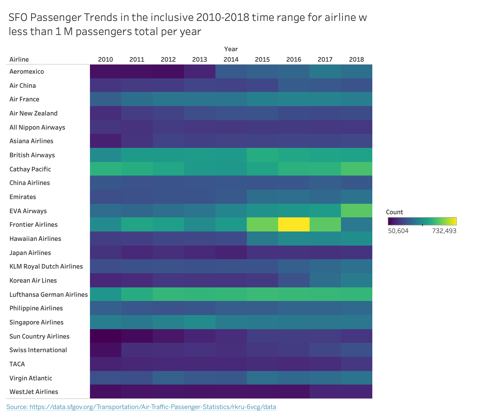
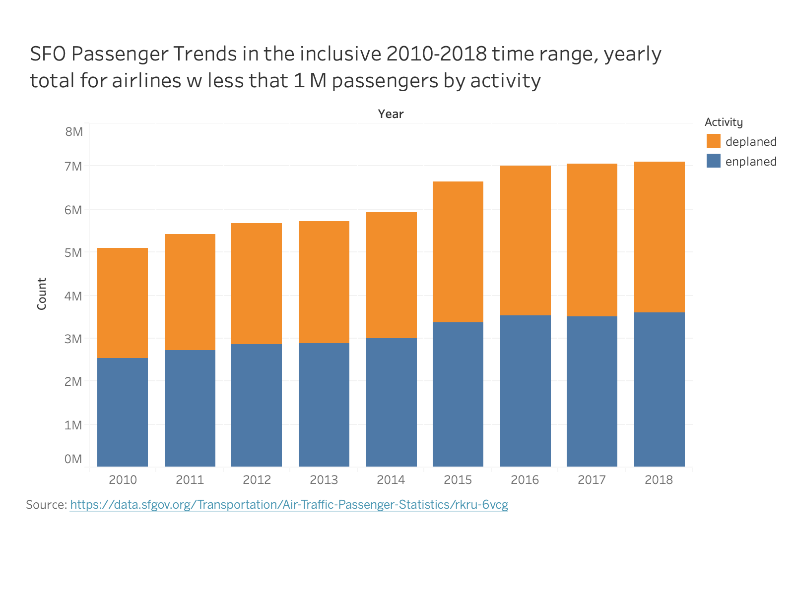
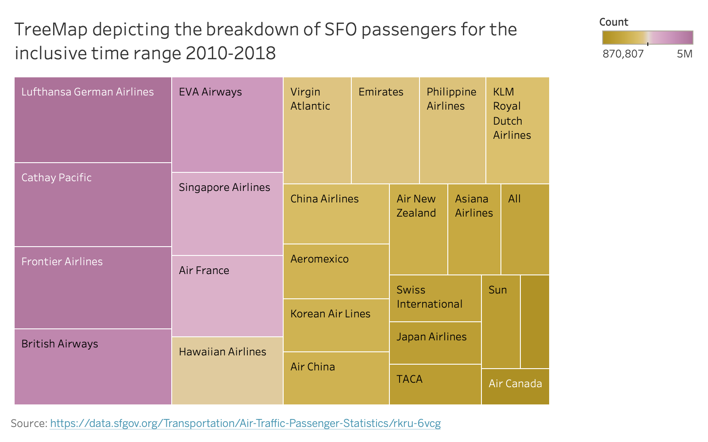

## Dataset

Source: [data.sfgov.org](data.sfgov.org) 
Publishing Department: Airport (SFO) 
Rows: **21.2K** 
Columns: **12** 
License: Public Domain Dedication and License v1.0 (PDDL) 
Accessed: _February 01, 2020_ 

## Brief Overview
Aiming for the highest grade **(A)** with submission of **_3_** Tableau prototypes & **_2_** D3.js visualizations

1. A heatmap visualizing number of passengers in the inclusive time range 2010 - 2018 for airlines that had less than 1M passengers per year
    * Encoded data using an acceptable encoding: **heatmap**
    * Data grouped by individual Operating Airline Passenger Count per year
    * Used Viridis color palette to encode the data, presented in the legend on the right
    * Used titles and axis labels
    * Included captions with my name and original data source
      
2. A stacked bar chart visualizing the number of passengers in the inclusive time range 2010 - 2018 for airlines that had less than 1M passengers per year, while separating them by activity (Enplaned vs Deplaned, which is equivalent to Arriving vs Departing passengers)
    * Encoded data using an acceptable encoding: **stacked bars**
    * Data grouped by Passenger Count for Activity Type across airlines satisfying above conditions (less than 1M passengers in total per annum) per year
    * Used two colors to differentiate Activity type, presented in the legend on the right
    * Used titles and axis labels
    * Included captions with my name and original data source

# Visualization 1

## Tableu Prototype

 

## Intepretation

On the X-axis we represent the inclusive time range 2010 - 2018, while the Y-axis represents the airline.

Passenger count in the heatmap is given for each airline (Y-axis) in a particular year (X-axis). Passenger count is encoded by Viridis color palette, with the legend displayed on the right-hand side. Colors with blue-ish hues are at the bottom of the scale representing smaller values, while colors with yellow-ish hues are at the top of the scale representing larger values.

## Data Wrangling

A row in the raw data represented passenger count for an airline in a given month of the year (this is a subset of each row info, as more columns were included in the original data). Data is slightly incomplete for the year 2019 and is missing 3 months. For this reason, 2019 related data was excluded.

After summarizing yearly passenger count for a particular airline, the following criteria were used to filter the results and exclude:
1. Airlines with passenger count > 1M for any particular year - so one can say this visualizes smaller volume airlines
2. Airlines that had gap data (missing any month or a year) in the original data

You can find the filtered data [here](../d3-vis/h1-heatmap/airlines-clean.csv).

## Conclusions

We can conclude that there is generally a growth trend, although not significant. One interesting case is the "Frontier Airline" who experienced massive growth in passengers through SFO during the inclusive 2013-2016 time range, and then sharply fell in the following years.

### SFO Passenger Trends in the inclusive 2010-2018 time range for airline w less than 1 M passengers total per year

<svg id="heatmap"></svg>

_Author: Dejan Djokic_  
_Original Data Source: [data.sfgov.org](data.sfgov.org)_ 

Resources/Inspirations: 
_[D3-Graph-Gallery](https://www.d3-graph-gallery.com/graph/heatmap_basic.html)_ 
_[Affordability Heatmap](https://blockbuilder.org/sjengle/47c5c20a18ec29f4e2b82905bdb7fe95)_ 
_[BlockBuilder Example](https://blockbuilder.org/achebrol/31833ec3fb7554d2b8e01e1ab32a09d1)_ 

# Visualization 2

## Tableu Prototype

 

## Intepretation

On the X-axis we represent the inclusive time range 2010 - 2018, while the Y-axis represents the number of passengers, in millions.

The stacked bars represent passenger activity (Enplaned vs Deplaned, which is equivalent to Arriving vs Departing passengers). We can reference the Y-axis to determine roughly the amount of passengers. But more so, we can compare the stacked bars from different years and see how the passenger count has changed for the two activities. Enplaned activity is represented with color hex `#4d78a7`, while Deplaned activity is represented with color hex `#f28e2c`.

## Data Wrangling

From [Visualization #1](#visualization-1) data manipulation we filtered the airlines that we are interested in. For those same airlines, we summed all of their passengers' counts for a particular passenger activity in a given year. Once again we excluded 2019 data due to incompleteness. Activity titled 'Transit' was also excluded, as it had only one data point.

You can find the filtered data [here](../d3-vis/h1-stacked-chart/data-clean.csv).

## Conclusions

We can conclude that the number of passengers Arriving and Departing stays more or less equally split for any given year. That is, it seems that there is a golden ration between Arriving and Departing passengers. Once again we can conclude that there is a growth trend overall in the number of passengers year-to-year just like we did in the first visualization. In this visualization, however, that is more apparent.

### A stacked bar chart visualizing the number of passengers in the inclusive time range 2010 - 2018 for airlines that had less than 1M passengers per year, while separating them by activity (Enplaned vs Deplaned)
<svg id="stacked"></svg>
_Author: Dejan Djokic_  
_Original Data Source: [data.sfgov.org](data.sfgov.org)_ 

Resources/Inspirations: 

_[D3-Graph-Gallery Ex 1](https://www.d3-graph-gallery.com/graph/custom_legend.html)_ 
_[D3-Graph-Gallery Ex 2](https://www.d3-graph-gallery.com/graph/barplot_stacked_basicWide.html)_ 
_[BlockBuilder Example](https://observablehq.com/@ericd9799/learning-stacked-bar-chart-in-d3-js)_ 

# Visualization 3 - Prototype Only

 

